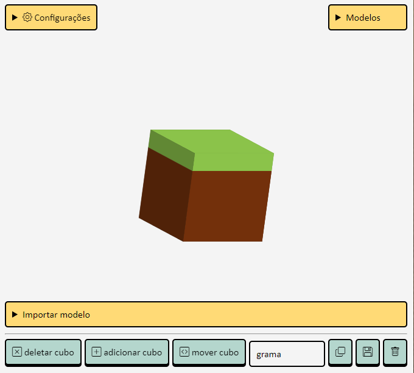

# 3D EDITOR

by: [@v.ii.n.i](https://instagram.com/v.ii.n.i)

	Projeto feito com JS para a criação e edição de modelos 3d, a partir de cubos.
	Quer testar? Agora está disponível no github pages [3d_editor : https://gitviini.github.io/3d_editor](https://gitviini.github.io/3d_editor)

### Features
#### CONFIGURAÇÕES
* Selecionar bloco ao clicar;
* Mover blocos;
* Rotacionar blocos;
* Determinar cor;
* Determinar filtro (drop-shadow() e etc).
#### AÇÕES
* Importar modelo pelo html;
* Adicionar modelo com botão esquerdo do mouse;
* Deletar modelo com botão direito do mouse;
* Salvar/copiar modelo como arquivo (.txt);
* Adicionar bloco;
* Deletar bloco;
* Mover preview (quando ativo mostra nome das faces).