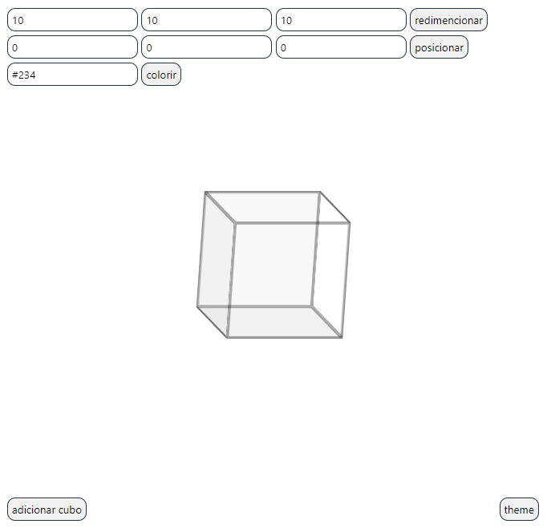

# 3D EDITOR

by: [@v.ii.n.i](https://github.com/v.ii.n.i)

	Projeto feito com JS para a criação e edição de modelos 3d, a partir de cubos.

### Features
#### CONFIGURAÇÕES
* Selecionar bloco ao clicar;
* Mover blocos;
* Determinar cor;
* Determinar filtro (drop-shadow() e etc).
#### AÇÕES
* Importar modelo pelo html;
* Adicionar bloco;
* Deletar bloco;
* Mover.